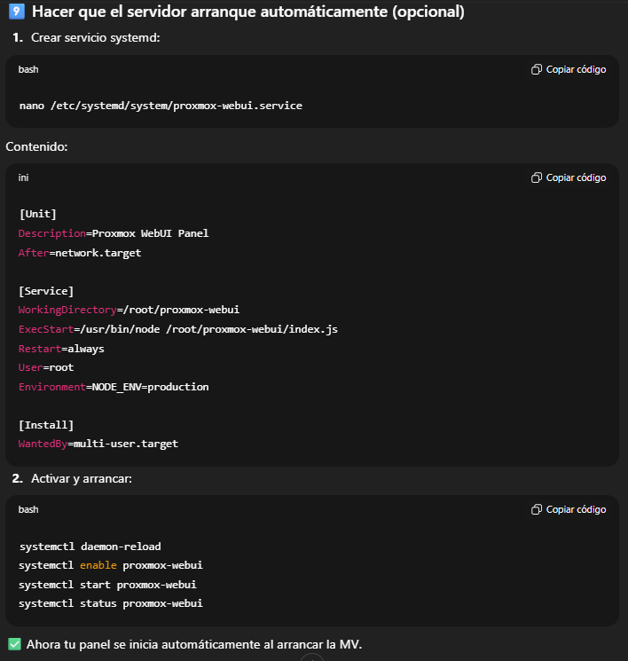

## Pasos para duplicar la idea:

Trataremos de hacer una web con la API de Proxmox que permita cargar sus consolas NoVNC, y permita realizar todas las tareas de Encendido, apagado, reinicio, etc de las opciones de energía. Todo ello para evitar que los usuarios se conecten a la interfaz de proxmox.

### Prerequisitos:
- Proxmox VE instalado
- Acceso a la red local
- Usuario root o un usuario con permisos para crear tokens

### Pasos:

#### 1. Instalar Node.js y npm
```bash
apt update && apt upgrade -y
apt install curl wget nano git -y

curl -fsSL https://deb.nodesource.com/setup_20.x | bash -
apt install -y nodejs
```

#### 2. Crear la carpeta del proyecto
```bash
mkdir -p /root/proxmox-webui
cd /root/proxmox-webui
```

#### 3. Crear un fichero de configuración
Solo permitiremos al root entrar a él por seguridad
```bash
nano /root/proxmox-webui/config.json
chmod 600 config.json
```
```bash
Su contenido será similar a este
{
  "proxmox_ip": "",
  "node_name": "",
  "token_id": "",
  "token_secret": "",
  "allowed_vms": []
}
```
Para tener el token debemos:  
- Crear un usuario
- Ir a Datacenter → Permissions → API Tokens → Darle Permiso de PVEVMUser

#### 4. Crear el backend

```bash
nano /root/proxmox-webui/index.js
```

#### 5. Crear el fronted

```bash
mkdir -p /root/proxmox-webui/public
cd /root/proxmox-webui/public
nano console.html
```

Instalamos la dependencias que necesitamos
```bash
cd /root/proxmox-webui
npm init -y
npm install express axios
```

#### 6. Lo ponemos en marcha
```bash
node index.js
```

Opcional:
